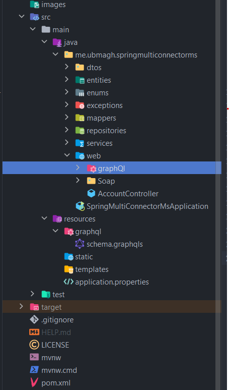
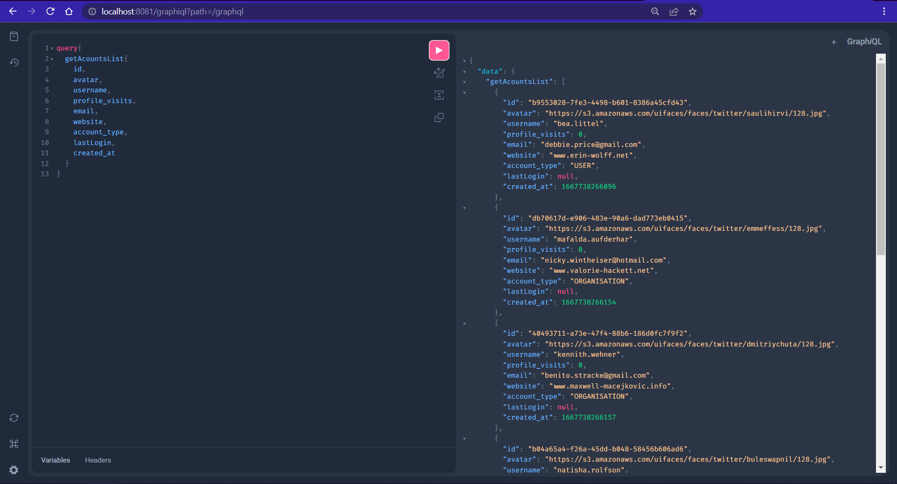
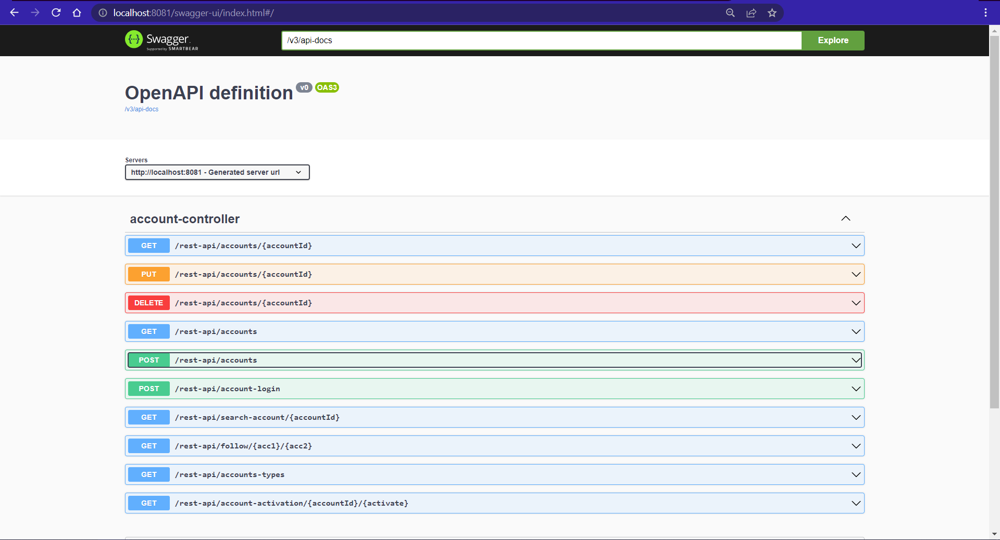
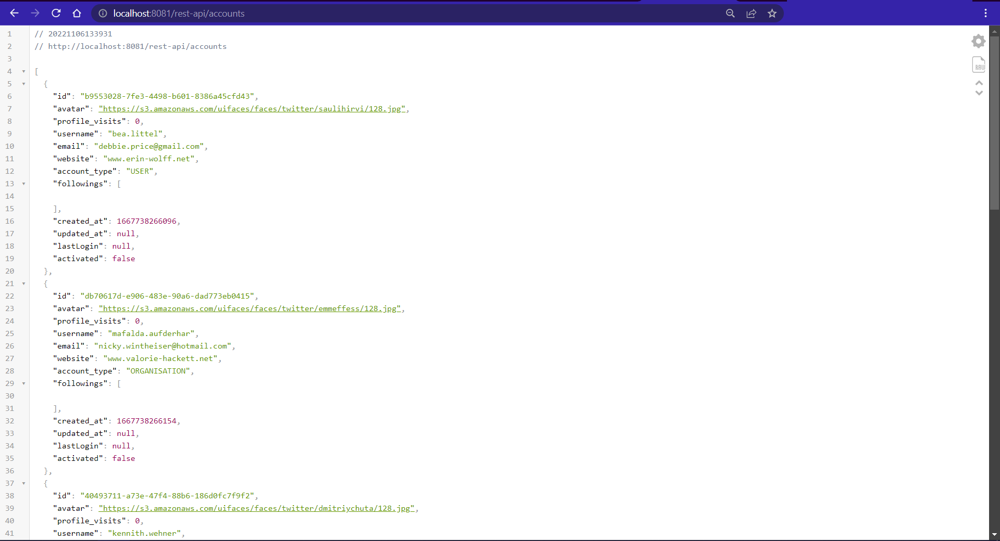
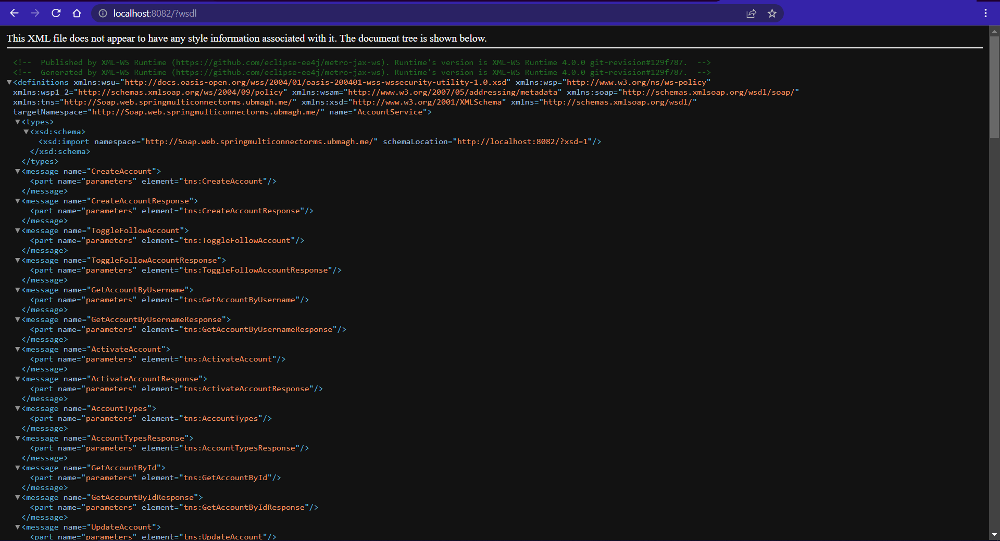
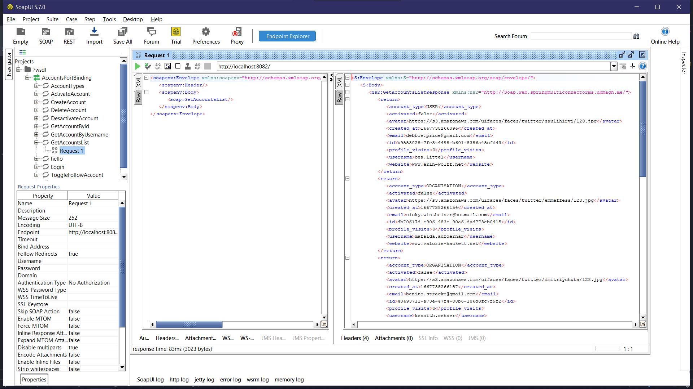

# Spring multiconnector microservice

> a small spring microservice to manage accounts (like Github account) with Soap/Rest Api/ GraphQl endpoints 

* content : 


1. [Project :](README/#project_:)
2. [Details ](README/#details_)
3. [Tests : ](README/#tests_:_)


<br>

## Project :

```yaml
    - java : 17
    - spring boot : 2.7.5
    - packages : 
        - so many check pom.xml 
```

-> [👉 pom.xml](./pom.xml)

-> [👉 application.properties ](./src/main/resources/application.properties)

<br>

### Project Structure : 

<p align="center">

</p>


<br>

## Details 

<details>
  <summary> Expand details section </summary>
<hr>
<br>


### Dtos : 


* [👉 AccountRequestDTO ](./src/main/java/me/ubmagh/springmulticonnectorms/dtos/AccountRequestDTO.java)

```java
@Builder
@XmlRootElement(name = "AccountRequestDTO")
public class AccountRequestDTO {

    private String avatar;

    private String username;
    private String password;

    private String email;
    private String website;
    private AccountTypeEnum account_type;

    private String current_password;

    public AccountRequestDTO() {
    }

    public AccountRequestDTO(String avatar, String username, String password, String email, String website, AccountTypeEnum account_type, String current_password) {
        this.avatar = avatar;
        this.username = username;
        this.password = password;
        this.email = email;
        this.website = website;
        this.account_type = account_type;
        this.current_password = current_password;
    }

    // .... setters & getters 
}    
```

* [👉 AccountResponseDTO ](./src/main/java/me/ubmagh/springmulticonnectorms/dtos/AccountResponseDTO.java)

```java
@Builder
@XmlRootElement(name = "AccountResponseDTO")
public class AccountResponseDTO {

    private String id;

    private String avatar;
    private int profile_visits;

    private String username;

    private String email;
    private String website;
    private AccountTypeEnum account_type;

    private List<AccountResponseDTO> followings = new ArrayList<>();

    private Long created_at;
    private Long updated_at;
    private Long lastLogin;

    private boolean activated;

    public AccountResponseDTO() {
    }
    
   // ... Getters & Setters
   
}
```

* [👉 LoginRequest ](./src/main/java/me/ubmagh/springmulticonnectorms/dtos/LoginRequest.java)

```java
@Builder
@XmlRootElement(name = "LoginRequest")
public class LoginRequest {

    private String username;
    private String password;

    public LoginRequest() {
    }

    public LoginRequest(String username, String password) {
        this.username = username;
        this.password = password;
    }
 
    // ... getters & setters
}     
```


<br>

### Entities (Jpa)

* [👉 Account ](./src/main/java/me/ubmagh/springmulticonnectorms/entities/Account.java)

```java
@Data
@AllArgsConstructor
@NoArgsConstructor
@Entity
@Builder
@Table(name = "app_accounts")
public class Account {

    @Id
    private String id;

    private String avatar;
    private int profile_visits;

    @Column(unique = true, nullable = false)
    private String username;
    @Transient
    private char[] password;

    private String email;
    private String website;
    @Enumerated(EnumType.STRING)
    private AccountTypeEnum account_type;

    @ManyToMany()
    private List<Account> followings = new ArrayList<>();

    private Long created_at;
    private Long updated_at;
    private Long lastLogin;

    private boolean activated;
}
```


<br>

### Enums : 

* [👉 Enum ](./src/main/java/me/ubmagh/springmulticonnectorms/enums/AccountTypeEnum.java)

```java
@XmlEnum()
public enum AccountTypeEnum {
    ORGANISATION, USER;

    public String value() {
        return name();
    }

    public static AccountTypeEnum fromValue(String v) {
        return valueOf(v);
    }
}
```


<br>

### Exceptions :

* [👉 AccountIdNotFoundException ](./src/main/java/me/ubmagh/springmulticonnectorms/exceptions/AccountIdNotFoundException.java)
* [👉 AccountUsernameNotFoundException ](./src/main/java/me/ubmagh/springmulticonnectorms/exceptions/AccountUsernameNotFoundException.java)
* [👉 PasswordIncorrectException ](./src/main/java/me/ubmagh/springmulticonnectorms/exceptions/PasswordIncorrectException.java)
* [👉 UsernameAlreadyExistsException ](./src/main/java/me/ubmagh/springmulticonnectorms/exceptions/UsernameAlreadyExistsException.java)


<br>

### Mappers :

* Implemented a MapStruct mapper :  [👉 AccountsMapper ](./src/main/java/me/ubmagh/springmulticonnectorms/mappers/AccountsMapper.java )

```java
@Mapper(componentModel = "spring")
public interface AccountsMapper  {

    AccountResponseDTO fromAccount(Account account);

    @Mapping(target = "password", ignore = true)
    Account fromAccountRequestDTO(AccountRequestDTO accountRequestDTO);

    @AfterMapping
    default void setPassword(@MappingTarget Account account, AccountRequestDTO accountRequestDTO) {
        String password = accountRequestDTO.getPassword();
        account.setPassword(password.toCharArray());
    }

}
```


<br>

### Repositories : 

* One single Account Repository ;  [👉 AccountRepository ](./src/main/java/me/ubmagh/springmulticonnectorms/repositories/AccountRepository.java )

```java
@Repository
public interface AccountRepository extends JpaRepository<Account, String> {

    Optional<Account> findByUsername(String username);

}
```

<br>

### Services : 

* I created first the interface : [👉 AccountService ](./src/main/java/me/ubmagh/springmulticonnectorms/services/AccountService.java)

* Then it's implemented in : [👉 AccountServiceImpl ](./src/main/java/me/ubmagh/springmulticonnectorms/services/AccountServiceImpl.java)

```java
@Service
@Transactional
@AllArgsConstructor
public class AccountServiceImpl implements AccountService {

    private AccountRepository accountRepository;
    private AccountsMapper mapper;

    @Override
    public AccountResponseDTO getAccountById(String accountId) throws AccountIdNotFoundException {
        Account account = accountRepository.findById( accountId ).orElseThrow(() -> new AccountIdNotFoundException(accountId));
        if( account.isActivated())
            account.setProfile_visits( account.getProfile_visits()+1 );
        return mapper.fromAccount(account);
    }

    @Override
    public AccountResponseDTO getAccountByUsername(String Username) throws AccountUsernameNotFoundException {
        Account account = accountRepository.findByUsername( Username ).orElseThrow(() -> new AccountUsernameNotFoundException(Username));
        if( account.isActivated())
            account.setProfile_visits( account.getProfile_visits()+1 );
        return mapper.fromAccount(account);
    }

    @Override
    public List<AccountResponseDTO> getAccountsList() {
        List<Account> accounts = accountRepository.findAll();
        return accounts.stream().map(account -> mapper.fromAccount(account)).collect(Collectors.toList());
    }

    // ......
    
}
```


<br>

### Web controllers & Endpoints definition : 

#### GraphQl : 

* I've created the GraphQl controller:  [👉 AccountsQraphQlController ](./src/main/java/me/ubmagh/springmulticonnectorms/web/graphQl/AccountsQraphQlController.java)

```java
@Controller
@AllArgsConstructor
public class AccountsQraphQlController {

    private AccountService accountService;

    @QueryMapping
    public List<AccountResponseDTO> getAcountsList(){
        return accountService.getAccountsList();
    }

    @QueryMapping
    public AccountResponseDTO getAcount( @Argument String accountId){
        AccountResponseDTO account=null;
        try{
            account = accountService.getAccountById(accountId);
        }catch (AccountIdNotFoundException exc){
            throw new ResponseStatusException( HttpStatus.NOT_FOUND, exc.getMessage() );
        }
        return account;
    }

    //  .....;
    
}
```

* Also this class to resolve exception for graphql : [👉 CustomExceptionResolver ](./src/main/java/me/ubmagh/springmulticonnectorms/web/graphQl/CustomExceptionResolver.java)

```java
@Component
public class CustomExceptionResolver extends DataFetcherExceptionResolverAdapter {
    @Override
    protected GraphQLError resolveToSingleError(Throwable ex, DataFetchingEnvironment env) {
        if (ex instanceof ResponseStatusException) {
            ErrorType type= null;
            switch ( ((ResponseStatusException) ex).getStatus() ){
                case NOT_FOUND :
                    type = ErrorType.NOT_FOUND;
                    break;
                default:
                    type = ErrorType.BAD_REQUEST;
            }
            return GraphqlErrorBuilder.newError()
                    .errorType(type)
                    .message(((ResponseStatusException) ex).getReason())
                    .path(env.getExecutionStepInfo().getPath())
                    .location(env.getField().getSourceLocation())
                    .build();
        } else {
            return null;
        }
    }
}
```

* Finally GraphQL schema : [👉 schema ](./src/main/resources/graphql/schema.graphqls)

```graphql
type Query {
    getAcountsList : [AccountResponseDTO],
    getAcount ( accountId:String): AccountResponseDTO,
    getAcountByUsername ( username:String): AccountResponseDTO,
    getAccountsTypes : [String],
}

type Mutation {
    createAccount ( request:AccountRequestDTO): AccountResponseDTO,
    updateAccount ( accountId:String, requestDTO:AccountRequestDTO): AccountResponseDTO,
    deleteAccount ( accountId:String ): AccountResponseDTO,
    following ( acc1:String, acc2:String ): [AccountResponseDTO],
    activateAccount ( accountId:String, activate:String ): AccountResponseDTO,
    loginAccount ( loginRequest: LoginRequest): AccountResponseDTO
}

#....

```

<br>

#### Rest endPoints : 

* one controller to define all apis : [👉 AccountController ](./src/main/java/me/ubmagh/springmulticonnectorms/web/AccountController.java)

````java
@AllArgsConstructor
@RestController
@RequestMapping("rest-api")
public class AccountController {

    private AccountService accountService;

    @GetMapping("/accounts")
    public List<AccountResponseDTO> getAcountsList() {
        return accountService.getAccountsList();
    }

    @GetMapping("/accounts/{accountId}")
    public AccountResponseDTO getAcount(@PathVariable("accountId") String accountId) {
        AccountResponseDTO account = null;
        try {
            account = accountService.getAccountById(accountId);
        } catch (AccountIdNotFoundException exc) {
            throw new ResponseStatusException(HttpStatus.NOT_FOUND, exc.getMessage());
        }
        return account;
    }


    @GetMapping("/search-account/{accountId}")
    public AccountResponseDTO getAcountByUsername(@PathVariable("username") String username) {
        AccountResponseDTO account = null;
        try {
            account = accountService.getAccountByUsername(username);
        } catch (AccountUsernameNotFoundException exc) {
            throw new ResponseStatusException(HttpStatus.NOT_FOUND, exc.getMessage());
        }
        return account;
    }


    @PostMapping("/accounts")
    public AccountResponseDTO createAccount(@RequestBody AccountRequestDTO request) {
        AccountResponseDTO account = null;
        try {
            account = accountService.createAccount(request);
        } catch (UsernameAlreadyExistsException exc) {
            throw new ResponseStatusException(HttpStatus.BAD_REQUEST, exc.getMessage());
        }
        return account;
    }

    // .....

}
````


<br>


#### SOAP EndPoints : 

* The web service : [👉 SoapAccountWebService ](./src/main/java/me/ubmagh/springmulticonnectorms/web/Soap/SoapAccountWebService.java)

```java
@WebService( name = "Accounts", serviceName = "AccountService" )
@Slf4j
public class SoapAccountWebService {

    private AccountService accountService;

    public SoapAccountWebService(AccountService accountService) {
        this.accountService = accountService;
    }

    public String hello() {
        return "Hello wolld !";
    }


    @WebMethod(operationName = "GetAccountById")
    public AccountResponseDTO getAccountById(@WebParam(name = "accountId") String accountId) throws AccountIdNotFoundException {
        AccountResponseDTO account = this.accountService.getAccountById(accountId);
        return account;
    }


    @WebMethod(operationName = "GetAccountByUsername")
    public AccountResponseDTO getAccountByUsername(@WebParam(name = "Username") String Username) throws AccountUsernameNotFoundException {
        AccountResponseDTO account = this.accountService.getAccountByUsername(Username);
        return account;
    }


    @WebMethod(operationName = "GetAccountsList")
    public List<AccountResponseDTO> getAccountsList() {
        List<AccountResponseDTO> accounts = accountService.getAccountsList();
        return accounts;
    }

    // ........

}
```

<br>

#### PSVM / entryPoint / Main Class : 

* it starts spring server, and contains two beans ; one to fill H2 db with faked data, and the other to start Soap server  : 

[👉 SpringMultiConnectorMsApplication ](./src/main/java/me/ubmagh/springmulticonnectorms/SpringMultiConnectorMsApplication.java)

```java
@Slf4j
@SpringBootApplication
public class SpringMultiConnectorMsApplication {

    public static void main(String[] args) {
        SpringApplication.run(SpringMultiConnectorMsApplication.class, args);
    }

    @Value("${server.soap-service-url}")
    private String url;

    @Bean(name = "SoapEndPointServiceBean")
    public Endpoint endpoint(AccountService accountService) {
        Endpoint endpoint = Endpoint.publish(url, new SoapAccountWebService(accountService));
        log.info(" 🚀 Soap service started on :  "+url);
        return endpoint;
    }

    @Bean
    CommandLineRunner fillDb(AccountService accountService) {
        Faker faker = new Faker();
        String[] enums = new String[]{"ORGANISATION", "USER"};
        return args -> {
            int rand = faker.random().nextInt(5, 20);
            while (rand-- > 1) {
                accountService.createAccount(
                        new AccountRequestDTO(
                                faker.avatar().image(),
                                faker.name().username(),
                                "123",
                                faker.internet().emailAddress(),
                                faker.internet().url(),
                                AccountTypeEnum.valueOf(enums[faker.random().nextInt(0, 1)]),
                                ""
                        )
                );
            }
        };
    }
}
```


<br>
<hr>

</details>

<br>

## Tests : 

### GraphQl  ;

<p align="center">

</p>

<br>

### Rest api ;

<p align="center">




</p>

<br>


### Soap endpoints tested with SoapUI : 

<p align="center">





</p>

<br>

<br>

> end.<
## Table of Contents

1. [HELP](/HELP)
	1. [Reference Documentation](HELP/#reference_documentation)
	2. [Guides](HELP/#guides)
2. [README](/README)
	1. [Project :](README/#project_:)
	2. [Details ](README/#details_)
	3. [Tests : ](README/#tests_:_)
